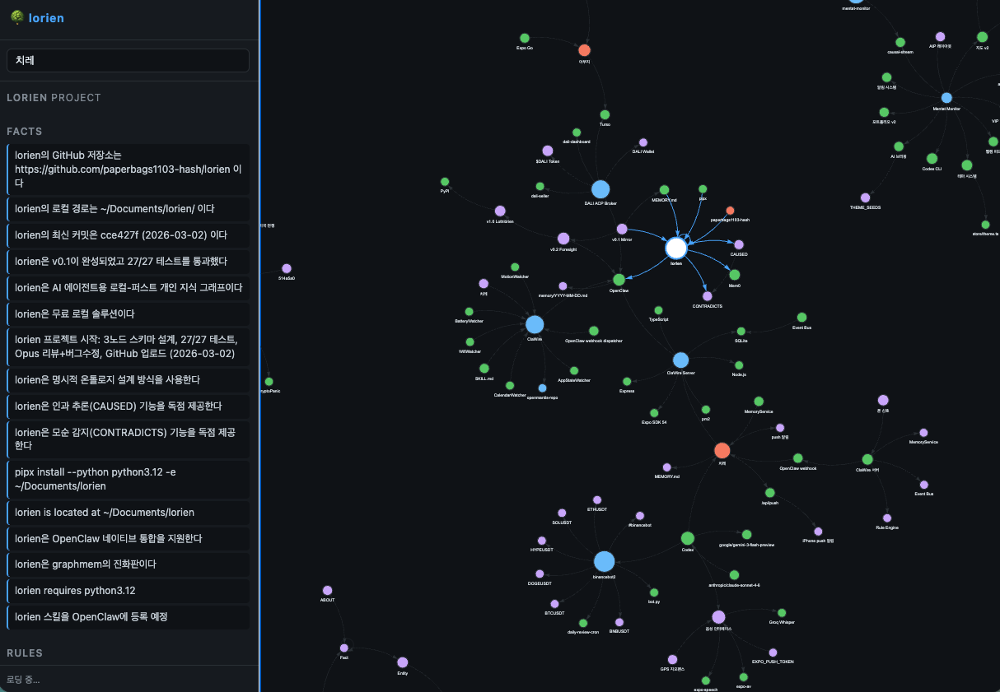

# 🌳 lorien

**Local-first personal knowledge graph for AI agents.**  
What to believe, why, and what conflicts — structured memory that Mem0 can't do.

```bash
pip install lorien-memory           # core (KuzuDB + CLI)
pip install "lorien-memory[vectors]"  # + semantic search
```

---

## Why lorien?

> *"Other tools tell you what the user said. lorien tells you what to believe, why, and what conflicts."*

lorien stores *structured knowledge* — not just flat strings. Every fact has a source, every rule has a priority, contradictions are detected automatically, and knowledge evolves over time. Local, free, no server required.

---



## Quickstart

```python
from lorien import LorienMemory

mem = LorienMemory(enable_vectors=True)

# Add a conversation
mem.add([
    {"role": "user",      "content": "I have a severe shellfish allergy. Oysters send me to the ER."},
    {"role": "assistant", "content": "Noted — I'll never recommend shellfish."},
], user_id="alice")

# 3 months later — new conversation
mem.add([
    {"role": "user",      "content": "Where should I eat tonight?"},
    {"role": "assistant", "content": "The new oyster bar on Main St is great!"},
], user_id="alice")

# Semantic search — finds allergy even without exact keywords
results = mem.search("seafood restrictions", user_id="alice")
# → [{"memory": "User has severe shellfish allergy...", "score": 0.82}]

# Auto-detected contradiction
contradictions = mem.get_contradictions()
# → [{"fact_a": "shellfish allergy...", "fact_b": "oyster bar recommendation..."}]

# Hard rules with priority
rules = mem.get_entity_rules("alice")
# → [{"text": "Never recommend shellfish to alice", "priority": 100}]
```

---

## Schema

lorien uses [KuzuDB](https://kuzudb.com) — an embedded graph database (like SQLite, but for graphs).

```
Agent ◄── CREATED_BY ─── Fact ─── ABOUT ───► Entity
                           │                    │
                       CONTRADICTS           HAS_RULE
                           │                    │
                           ▼                    ▼
                          Fact               Rule
                           │
                       SUPERSEDES
                           │
                           ▼
Decision ─── BASED_ON ──► Fact
    │
APPLIED_RULE ──► Rule
    │
DECIDED_BY ──► Agent
```

**5 node types:**
- **Entity** — people, organizations, topics (`canonical_key = "type:name"`)
- **Fact** — statements about entities (subject → predicate → object) with freshness tracking
- **Rule** — constraints with priority 0–100 (100 = absolute prohibition)
- **Agent** — LLM or human agent that created facts/decisions
- **Decision** — recorded decisions with supporting evidence and causal chain

**11 edge types:** `ABOUT`, `HAS_RULE`, `RELATED_TO`, `CAUSED`, `CONTRADICTS`, `SUPERSEDES`, `CREATED_BY`, `BASED_ON`, `APPLIED_RULE`, `DECIDED_BY`, `SUPERSEDES_D`

---

## v0.3 Features

### Temporal Tagging — Knowledge Freshness

Facts age. lorien tracks how fresh each piece of knowledge is.

```python
from lorien import LorienMemory, freshness_score

mem = LorienMemory()

# Check freshness (0.0–1.0, exponential decay, half-life 30 days)
score = mem.freshness(fact_id)      # 1.0 = confirmed today, 0.5 = 30 days ago

# Confirm facts are still accurate — resets freshness to 1.0
mem.confirm([fact_id1, fact_id2])

# Expire stale facts (old + low confidence)
result = mem.cleanup(max_age_days=90, min_confidence=0.3)
# → {"expired": 12}

# View how a fact evolved over time
history = mem.get_fact_history("alice", predicate="prefers")
# → [{"text": "Prefers Python 3.12", "version": 2, "freshness_score": 0.95, ...},
#    {"text": "Prefers Python 3.11", "version": 1, "status": "superseded", ...}]
```

Knowledge evolution (same fact updated over time) creates `SUPERSEDES` edges instead of `CONTRADICTS` — lorien distinguishes between "this is wrong" and "this changed."

---

### Multi-agent Shared Memory

Multiple AI agents writing to the same knowledge graph, with full provenance.

```python
mem = LorienMemory()

# Register agents
mem.register_agent("claude", name="Claude Sonnet", agent_type="llm")
mem.register_agent("codex",  name="GPT Codex",     agent_type="llm")

# Each agent records knowledge under its own identity
mem.add_with_agent(messages_from_claude, user_id="alice", agent_id="claude")
mem.add_with_agent(messages_from_codex,  user_id="alice", agent_id="codex")

# See what each agent contributed
mem.get_agent_stats("claude")
# → {"facts": 42, "rules": 5, "last_active_at": "2026-03-03T..."}

mem.get_agents()
# → [{"id": "claude", "name": "Claude Sonnet", ...}, ...]
```

**Concurrency:** `WriteQueue` serializes writes from multiple threads/agents — KuzuDB's single-writer constraint is handled automatically.

---

### Decision Archive

Record *why* decisions were made. Query the causal chain later.

```python
mem = LorienMemory()

# Record a decision with its evidence
did = mem.add_decision(
    "Use REST API over GraphQL",
    decision_type="judgment",
    context="Simple CRUD app, team familiar with REST",
    agent_id="claude",
    supporting_fact_ids=[fact_rest_id],    # REST is well-documented
    opposing_fact_ids=[fact_graphql_id],   # GraphQL reduces overfetching
    rule_ids=[rule_simplicity_id],         # Keep it simple (priority: 80)
)

# 6 months later: "why did we choose REST?"
result = mem.why(did)
# or by text search:
result = mem.why("REST API decision")

# → {
#     "decision": {"text": "Use REST API over GraphQL", "agent_id": "claude", ...},
#     "supporting_facts": [{"text": "REST is well-documented", ...}],
#     "opposing_facts":   [{"text": "GraphQL reduces overfetching", ...}],
#     "applied_rules":    [{"text": "Keep it simple", "priority": 80}],
#   }

# Search all decisions
mem.search_decisions("database")
# → [{"text": "Use PostgreSQL for persistence", ...}, ...]

# Revoke a decision
mem.revoke_decision(did)
```

---

## Contradiction Detection

After every fact is ingested, lorien automatically checks for semantic contradictions:

1. **Vector similarity** — find facts with similar meaning (threshold 0.55)
2. **Heuristic check** — negation pair patterns (허용↔금지, always↔never, must↔must not, ...)
3. **LLM confirmation** *(optional)* — yes/no question to any OpenAI-compatible model
4. **CONTRADICTS edge** — auto-created in the graph for later querying

```python
detector = ContradictionDetector(
    store=store,
    vector_index=vi,
    llm_model="gpt-4o-mini",
    api_key="sk-...",
    similarity_threshold=0.55,
)
n = detector.check_and_record(new_fact_id, new_fact_text)
```

---

## CLI

```bash
# Initialize
lorien init

# Check status (shows Entity/Fact/Rule/Agent/Decision counts)
lorien status

# Ingest a file (MEMORY.md, notes, etc.)
lorien ingest MEMORY.md
lorien ingest MEMORY.md --model haiku   # LLM extraction via OpenClaw

# Query the graph
lorien query "MATCH (e:Entity) RETURN e.name LIMIT 10"

# Show entity details
lorien show "alice"

# List contradictions
lorien contradictions

# Conversation memory for a user
lorien memory alice

# Web visualization (vis.js, no extra deps)
lorien serve
```

---

## OpenClaw Integration

lorien auto-detects the [OpenClaw](https://github.com/openclaw/openclaw) gateway when available:

```bash
lorien ingest MEMORY.md --model haiku   # routes through OpenClaw → Anthropic
lorien ingest notes.md  --model flash   # routes through OpenClaw → Gemini
```

No API key needed when OpenClaw gateway is running locally.

---

## Installation

```bash
# Core only (graph + CLI, no LLM, no vectors)
pip install lorien-memory

# With semantic search
pip install "lorien-memory[vectors]"

# With OpenAI-compatible LLM extraction
pip install "lorien-memory[llm]"

# Everything
pip install "lorien-memory[all]"
```

**Requirements:** Python 3.12+, no server, no Docker.  
DB stored at `~/.lorien/db`. Vectors at `~/.lorien/vectors.db`.

---

## Roadmap

- [x] v0.1 — Core graph schema (Entity, Fact, Rule + 5 edge types)
- [x] v0.1 — LLM ingest via OpenClaw gateway
- [x] v0.1 — Mem0-compatible `LorienMemory` API
- [x] v0.2 — Vector semantic search (sentence-transformers, multilingual)
- [x] v0.2 — Automatic contradiction detection
- [x] v0.2 — PyPI release (`pip install lorien-memory`)
- [x] v0.2 — LangChain adapter (`LorienChatMemory`)
- [x] v0.3 — Temporal tagging (freshness decay, SUPERSEDES, knowledge evolution)
- [x] v0.3 — Multi-agent shared memory (Agent node, CREATED_BY, WriteQueue)
- [x] v0.3 — Decision archive (`add_decision()`, `why()`, causal chain)
- [ ] v0.4 — Parameterized queries (hardened security)
- [ ] v0.4 — Agent conflict resolution
- [ ] v1.0 — Web UI (graph explorer + decision timeline)
- [ ] v1.0 — REST API server mode

---

MIT License · [GitHub](https://github.com/paperbags1103-hash/lorien) · [PyPI](https://pypi.org/project/lorien-memory/)
